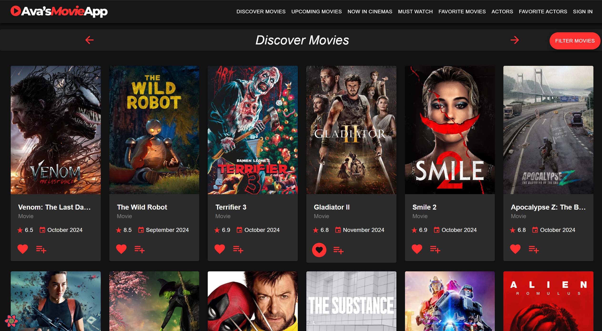

# Assignment 1 - ReactJS app 

Name: Ava Neary

## Overview.
This repository contains a ReactJS Movie Web App that fetches data from the TMDb API. It caches requests and displays lists of movies and actors, with filtering options, along with detailed pages for each movie and actor.

### Features ⭐

- **Updated Styles** 🖌️
  - A dark theme was implemented with a red primary color, inspired by Netflix.
  - Designed an icon in Canva for the SiteHeader, along with adding a small hover animation to menu items.
  - Added more styles to the Card components, adding slight hover animations and making content neater.
  - Cards now allow you to click on the actor/movie image to view details without the more info button.
  - Added more responsive styles to all pages, including movie/actor details.
  - Moved the filterCard to a drawer for a cleaner layout.
---
<div style="display: flex; justify-content: center; padding: 20px;">
  
</div>

---

- **Updated Pages** 📄
  - **Upcoming Movies Page**: Displays a list of upcoming movies from today's date.
  - **Now in Cinemas Page**: Displays a list of movies currently available in theatres.
  - **Actors Page**: Displays a list of all popular actors.
  - **Must Watch Page**: Displays a list of movies selected by the user to watch later.
  - **Favorite Actors Page**: Displays a list of favorite actors selected by the user.
  - **Movie Details page**: Displays details about a selected movie. Altered to include the top 10 popular actors that starred in the movie, as well as 10 recommendations for other movies that are similar.
  - **Actor Details page**: Displays details about a selected actor, including a list of their top 10 most popular movie roles. The Collapsible component was used for the biography.

---

**Updated API Methods and Endpoints** 🌐

| **Method**               | **Description**                                                                             | **Endpoint Used**                                 | **Parameters**                |
|--------------------------|---------------------------------------------------------------------------------------------|--------------------------------------------------|--------------------------------|
| `getMovies()`            | Updated to fetch movies dynamically by genre and supports pagination (used on Discover page). | `/discover/movie`                                | `page`, `genre`               |
| `getUpcomingMovies()`    | Fetches upcoming movies filtered from today’s date onwards, sorted by popularity.           | `/discover/movie`                                | `page`                        |
| `getNowShowingMovies()`  | Fetches movies currently playing in theaters, supports pagination.                         | `/movie/now_playing`                             | `page`                        |
| `getMovieCast()`         | Retrieves the top 10 most popular cast members for a specific movie, sorts them by most popular and takes the first 10 results. | `/movie/{movie_id}/credits`                      | `movie_id`                    |
| `getRecommendedMovies()` | Fetches recommended movies for a specific movie by its ID, sorted by popularity.           | `/movie/{movie_id}/recommendations`             | `movie_id`                    |
| `getActors()`            | Fetches a list of popular actors, supports pagination.                                      | `/person/popular`                                | `page`                        |
| `getActor()`             | Fetches detailed information about a specific actor by their ID.                            | `/person/{actor_id}`                             | `id`                          |
| `getActorImages()`       | Fetches images for a specific actor by their ID.                                           | `/person/{actor_id}/images`                      | `id`                          |
| `getActorMovieRoles()`   | Retrieves all movie credits for a specific actor by their ID, sorts them by most popular and takes the first 10 results. | `/person/{actor_id}/movie_credits`              | `id`                          |

---

- **Updated Functionality** ⚙️
  - **Favorite Actors**: Users can select actors to be added to a list and viewed in the Favorite Actors page.
  -  **Must Watch**: Users can select movies to be added to a list and viewed in the Must Watch page.
  - **Sorting and Filtering**: Users can use added sorting and filter options on all Pages.
  - **Collapsible Biography**: Biography can be expanded using a see more button for better layout
  - **Firebase**: Users can sign in with a Google account and logout by clicking their avatar.
  - **Pagination**: Users can navigate through different pages of results on each list page.
    
---

## Setup Requirements ⚙️

```bash
git clone https://github.com/Ayyvahh/react-movie-assignment.git

cd .\movies\

npm install
npm install firebase

2. Add .env file containing a TMDb api key in the root of the project and configure Firebase in /services/firebase.js

npm start

```

---

## Routing 💻

- `/` - **Home Page**: Displays the main landing page of the app.
- `/movies/upcoming` - **Upcoming Movies Page**: Displays a list of upcoming movies.
- `/movies/favorites` - **Favorite Movies Page**: Displays a list of user-selected favorite movies.
- `/movies/mustWatch` - **Must Watch Page**: Displays a list of movies that the user wants to watch.
- `/movies/nowShowing` - **Now Showing Movies Page**: Displays a list of movies currently playing in theaters.
- `/actors` - **Actors List Page**: Displays a list of popular actors.
- `/actors/favorites` - **Favorite Actors Page**: Displays a list of user-selected favorite actors.
- `/actors/:id` - **Actor Details Page**: Displays detailed information about a specific actor.
- `/movies/:id` - **Movie Details Page**: Displays detailed information about a specific movie.
- `/reviews/:id` - **Movie Review Page**: Displays reviews for a specific movie.
- `/reviews/form` - **Add Movie Review Page**: Allows the user to add a new movie review.

---


## Independent Learning 🧑‍🎓
- [Firebase](https://www.youtube.com/watch?v=eh8mpiN-7bA)
- [CSS animations/styling](https://styled-components.com/docs/basics#animations)
- [Responsive styling and functionality](https://www.youtube.com/watch?v=co-m3bfIxKQ)

- [GeeksForGeeks](https://www.geeksforgeeks.org/reactjs-components-complete-reference/?ref=shm), [W2Schools](https://www.w3schools.com/) and [MUI Documentation](https://mui.com/) were used for syntax references and implementation techniques.


